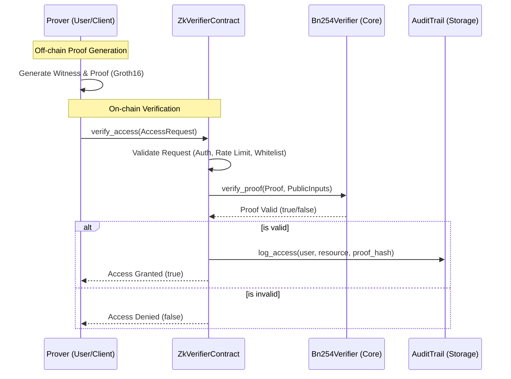

# Zero-Knowledge Architecture Overview

This document provides a high-level overview of the Zero-Knowledge (ZK) subsystem in the Teye ecosystem. The ZK subsystem enables privacy-preserving access control by allowing users to prove eligibility or possession of credentials without revealing sensitive underlying data.

## System Architecture

The ZK subsystem is built on Top of the Soroban network and utilizes the BN254 elliptic curve for efficient cryptographic operations.

## Cryptographic Primitives

- **Curve**: **BN254** (also known as Alt-BN128). This curve is efficient for pairing-friendly operations on-chain.
- **Proof System**: **Groth16**. Chosen for its small proof size (constant 3 points) and extremely fast verification time.
- **Hashing**: **Poseidon**. A ZK-friendly hash function used for committing to public inputs.

## Proof Lifecycle

1. **Circuit Design**: Developers define the constraints of the proof (e.g., "user has age > 18") using a DSL like Circom.
2. **Setup**: One-time generation of Proving and Verifying Keys.
3. **Proof Generation (Off-chain)**: The user generates a witness and a Groth16 proof using their private data and the Proving Key.
4. **Submission**: The user formats the proof into an `AccessRequest` and submits a transaction to the `ZkVerifierContract`.
5. **On-chain Verification**: The contract validates the proof against the Verifying Key and public inputs.
6. **Auditing**: If successful, a hash of the verification is logged in the `AuditTrail` for transparency and compliance.

## Security Considerations

- **Degenerate Proofs**: The contract rejects proofs where points A, B, or C are zero.
- **Rate Limiting**: Protects against denial-of-service attacks and brute-force proof submission.
- **Whitelisting**: Optional enforcement of authorized addresses for specialized resources.
